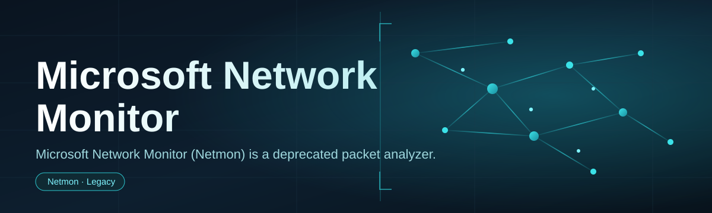
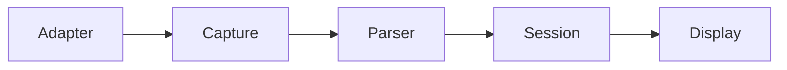

# network-monitor-controller 📡🛰️

  

*A control layer for classic packet capture workflows — bringing a legacy protocol analyzer back into a modern, click-friendly cockpit.*

  

---

## 👀 What this is NOT

This is **not** a packet-crafting toy, **not** a Wireshark clone chasing feature parity, and **not** a corporate rewrite of a discontinued product pretending it never went away.

What it **actually is**: a lightweight controller and companion shell built around the spirit of Microsoft Network Monitor — the venerable Windows packet analyzer originally engineered by Raymond Patch on the LAN Manager team. It doesn't resurrect abandoned code; it gives you a clean, opinionated interface for driving capture sessions, organizing traces, and reading protocol frames without wrestling fifteen menus to get there.

If you just want to see what's actually crossing your network interface — cleanly, quickly, without a PhD in filter syntax — that's the itch this scratches.

---

## 🧭 Overview

**network-monitor-controller** exists because network monitoring tooling on Windows has always split into two camps: enterprise suites that need a dedicated team to configure, and raw command-line sniffers that assume you already know what you're looking for. Neither is fun to open at 2am when a service is silently dropping packets.

This project sits in between. It's a standalone Windows application that wraps the fundamentals of network protocol analysis — capture, filter, decode, inspect — into a single window that feels like it was designed in 2026, not ported from 2004. Under the hood, it leans on the same conceptual pipeline that made the original Network Monitor useful: frame capture, protocol parsing, and a display pane that doesn't require squinting.

It's built for **network engineers debugging flaky connections**, **support techs who need evidence, not guesses**, **students learning how TCP/IP actually behaves on the wire**, and **hobbyists** who just enjoy watching packets move. No telemetry, no cloud dependency, no nonsense — just a controller sitting on top of your network adapter, doing the one job it was built for.

> [!NOTE]
> This tool is a controller/interface layer. It orchestrates capture sessions and protocol decoding — it does not require any third-party network analyzer to be pre-installed.

---

## 🔥 What It Actually Does

**Live capture, no ceremony** — start pulling frames off an interface in a couple of clicks, with sane defaults instead of a wizard.

**Protocol-aware decoding** — Ethernet, IP, TCP, UDP, DNS, HTTP frames get parsed into readable structures instead of raw hex soup.

**Session-based trace management** — every capture is a session you can name, pause, resume, and revisit — nothing vanishes when you blink.

**Adapter-level control** — pick your network interface directly from the controller, switch between adapters without restarting the app.

**Frame-level drill-down** — click any packet and expand it layer by layer, from the physical frame up to the application payload.

**Lightweight filtering** — narrow noisy traffic down to the conversation that actually matters, using simple, readable filter expressions.

**Exportable traces** — save capture sessions locally so you can hand them to a colleague or revisit them after the incident is long over.

**Zero-install footprint** — a standalone executable that behaves like a portable tool, not a system service that outlives its usefulness.

> [!TIP]
> Rename your capture sessions the moment you start them. "Capture_1" tells future-you nothing at 3am.

---

## 🚀 How To Get Started

1. **Visit the landing page** — hit the download button above or below.

2. **Download the package** — grab the current 2026 build for Windows.

3. **Run the controller** — no setup wizard, no registry gymnastics.

4. **Pick an adapter and start capturing** — you'll be watching live traffic inside a minute.

> [!IMPORTANT]
> Packet capture on Windows generally requires administrator privileges. Run the controller elevated if your capture session refuses to start.

---

## 🖥️ System Requirements

| Requirement | Detail |
|---|---|
| **OS** | Windows 10 or Windows 11 (64-bit) |
| **Dependencies** | None — fully standalone |
| **Disk space** | Under 100 MB |
| **Network** | Any standard Ethernet or Wi-Fi adapter |
| **Privileges** | Administrator recommended for live capture |
| **Internet** | Not required after download |

  

---

## ⚙️ How It Works

The controller follows a straightforward pipeline every time you launch a capture session:

1. **Adapter selection** — the controller enumerates available network interfaces.

2. **Capture initiation** — raw frames are pulled from the selected adapter.

3. **Protocol parsing** — each frame is decoded layer by layer against known protocol definitions.

4. **Session buffering** — decoded frames are organized into the active session for review.

5. **Display rendering** — the UI presents readable, filterable output in real time.

> [!NOTE]
> Parsing happens incrementally — you don't wait for a capture to finish before you can start reading it.

---

## 🧩 Troubleshooting

<strong>No adapters show up in the list</strong>

Run the controller as Administrator. Windows restricts raw packet capture access for standard user accounts.

<strong>Capture starts but shows zero traffic</strong>

Confirm you selected the adapter actually carrying traffic — laptops often have multiple virtual adapters (VPN, VM, tunnel) that sit idle.

<strong>The app feels sluggish during long captures</strong>

Very high-throughput interfaces generate large session buffers fast. Pause and export periodically rather than running one marathon session.

<strong>Decoded protocol fields look incomplete</strong>

Some encrypted or proprietary traffic can't be fully decoded at the application layer — that's expected behavior, not a bug.

<strong>Filters aren't matching anything</strong>

Double-check filter syntax — a stray operator or mistyped protocol name will silently return an empty result instead of erroring.

<strong>Windows Defender flags the executable</strong>

Packet capture tools trigger heuristic flags often. Verify the download came from the official landing page linked in this README.

---

## 🎨 UI / UX Details

The interface is built for people who live in a capture window for hours, not minutes.

### Keyboard Shortcuts

| Shortcut | Action |
|---|---|
| `Ctrl + N` | Start a new capture session |
| `Ctrl + S` | Save / export current session |
| `Space` | Pause / resume active capture |
| `Ctrl + F` | Focus the filter bar |
| `Ctrl + L` | Clear the current display |
| `Ctrl + Tab` | Switch between open sessions |
| `Ctrl + Shift + A` | Open adapter selection panel |
| `F5` | Refresh interface list |
| `Ctrl + E` | Expand/collapse selected frame details |
| `Ctrl + ,` | Open settings |

> [!TIP]
> `Ctrl + F` followed by a protocol name (e.g. `dns`, `tcp`) is the fastest way to isolate a conversation.

### Themes & Settings

- Light and dark themes, switchable instantly from the settings panel.

- Adjustable column widths and frame-detail pane sizing, remembered between sessions.

- Configurable capture buffer limits to balance memory use against session length.

---

## 🤝 Contributing & Community

This project grows through people who actually use it under pressure — during outages, audits, and 2am debugging sessions.

> Contributions of all sizes matter: a typo fix, a protocol decoder improvement, or a UI polish PR are equally welcome.

- Open an issue for bugs, oddities, or protocol decoding gaps.

- Submit pull requests for fixes, refinements, or new filter capabilities.

- Share feedback on the UI — this project is shaped by real debugging workflows, not guesswork.

 

---

## 📜 License

Released under the [MIT License](LICENSE), 2026.

Use it, modify it, ship it inside your own tooling — just keep the license notice intact.

---

## ⚠️ Disclaimer

> [!WARNING]
> This tool is intended for **legitimate network diagnostics on networks and systems you own or are authorized to monitor**. Capturing traffic on networks without proper authorization may violate local laws or organizational policy.

The maintainers assume no liability for misuse. Network Monitor-style capture tools are powerful diagnostic instruments — treat them with the same care you'd give any tool that can see everything crossing a wire.

---

